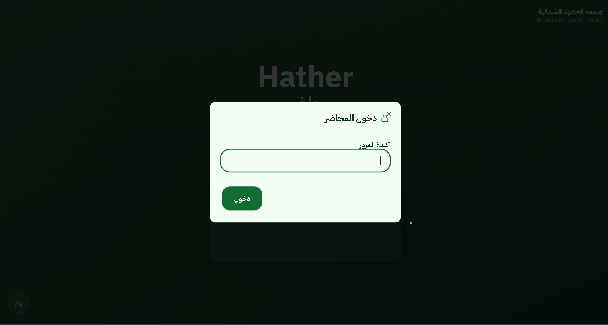

# HATHER Attendance

HATHER is a web-based attendance system that simplifies classroom attendance using QR codes. Students scan a QR code, enter their university ID, and their attendance is recorded automatically.

The project was developed as a Computer Science project and focuses on providing a simple, responsive, and easy-to-use attendance experience for both students and instructors.


## Technologies Used

### Frontend
- React
- TypeScript
- HTML
- CSS

### Backend
- Node.js
- Express

### External Services
- Google Apps Script
- Google Sheets

## Project Structure

```
HATHER/
├── artifacts/
│   ├── hather/          # Frontend
│   └── api-server/      # Backend API
├── lib/                 # Shared libraries
├── README.md
```

## Installation

Clone the repository:

```bash
git clone <repository-url>
```

Install dependencies:

```bash
pnpm install
```

Run the development server:

```bash
pnpm dev
```

## Screenshot

### Student Attendance Page


### Teacher Login



### QR Code Generator


### Generated QR Code


## Future Improvements

- Attendance reports.
- Analytics dashboard.
- Email notifications.
- Better authentication.
- Cloud deployment.

## License

This project is intended for educational and portfolio purposes.

- ## Author

**Mohammed al majed**
